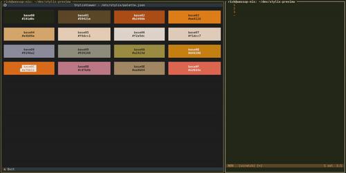

# stylix preview

The goal of this project is to make working with [Stylix](https://nix-community.github.io/stylix/) easier by visualizing palettes.

demo of the previewer running alongside a text editor:

## features

- list base16 colors from `.json`, `.yaml` and `.yml`
  - copy hex values to clipboard on button press
- choose palettes by either:
  - passing a path as an argument: `pixi run start /etc/stylix/palette.json`
  - or by pressing `f` and typing in a valid path at runtime

## pixi usage

Pixi configuration lives in `pyproject.toml`.

- install the environment: `pixi install`
- run the app: `pixi run start /path/to/palette.json`
- dev mode (css hot reload): `pixi run watch`

## nix usage

- run the app:
  - `nix run`
  - `nix run . -- /path/to/palette.json`
- build the package:
  - `nix build`
  - artifacts are in `./result`
- dev shell:
  - `nix develop`

## uses

- [Textual](https://textual.textualize.io/getting_started/) - TUI package
- [Pixi](https://pixi.prefix.dev) - Python package manager
- of course, [Nix flakes](https://wiki.nixos.org/wiki/Flakes#Development_shells) - reproducible dev shell

## ideas, todos

- package the tool into single executable
- rework palette models so the `base` concept is required and the actual values are dynamic -> no differentiation between base16 and base24 is needed
- add a help page on key `?`
- add title, author etc if availble in the file
- list multiple palettes from directory
